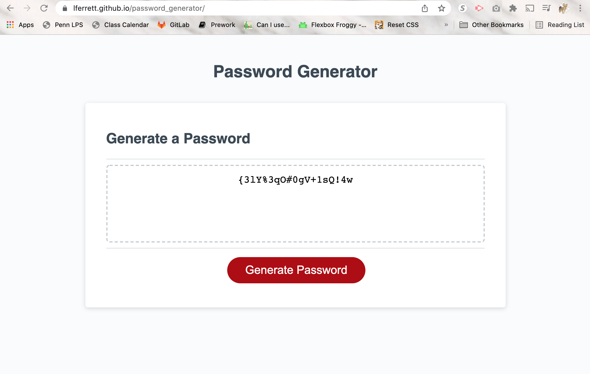

# Password Generator

## Description

The goal of this project was to modify existing code to create a working password generator using HTML and JavaScript. The password generator should generate a password upon clicking the button on the website, prompting the user for criteria, including length and what characters to use in the final password. The generated password should then be displayed in an alert or written to the page. 

## Table of Contents

- [Installation](#installation)
- [Usage](#usage)
- [Credits](#credits)
- [License](#license)

## Installation

Installation for this website is done by clicking the link at: https://lferrett.github.io/password_generator/

## Usage

This website can be accessed by visiting: https://lferrett.github.io/password_generator/

A screenshot of the final product, including generated password is below:

## Credits

Coding was completed by Lauren Ferrett, using references from class activities, as well as reference materials contained on: https://www.w3schools.com/js/ and https://developer.mozilla.org/en-US/docs/Web/JavaScript. 

## License

MIT License

Copyright (c) 2021 Lauren Ferrett

Permission is hereby granted, free of charge, to any person obtaining a copy
of this software and associated documentation files (the "Software"), to deal
in the Software without restriction, including without limitation the rights
to use, copy, modify, merge, publish, distribute, sublicense, and/or sell
copies of the Software, and to permit persons to whom the Software is
furnished to do so, subject to the following conditions:

The above copyright notice and this permission notice shall be included in all
copies or substantial portions of the Software.

THE SOFTWARE IS PROVIDED "AS IS", WITHOUT WARRANTY OF ANY KIND, EXPRESS OR
IMPLIED, INCLUDING BUT NOT LIMITED TO THE WARRANTIES OF MERCHANTABILITY,
FITNESS FOR A PARTICULAR PURPOSE AND NONINFRINGEMENT. IN NO EVENT SHALL THE
AUTHORS OR COPYRIGHT HOLDERS BE LIABLE FOR ANY CLAIM, DAMAGES OR OTHER
LIABILITY, WHETHER IN AN ACTION OF CONTRACT, TORT OR OTHERWISE, ARISING FROM,
OUT OF OR IN CONNECTION WITH THE SOFTWARE OR THE USE OR OTHER DEALINGS IN THE
SOFTWARE.